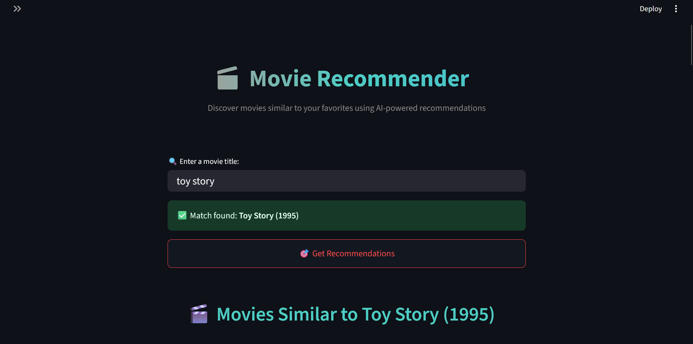
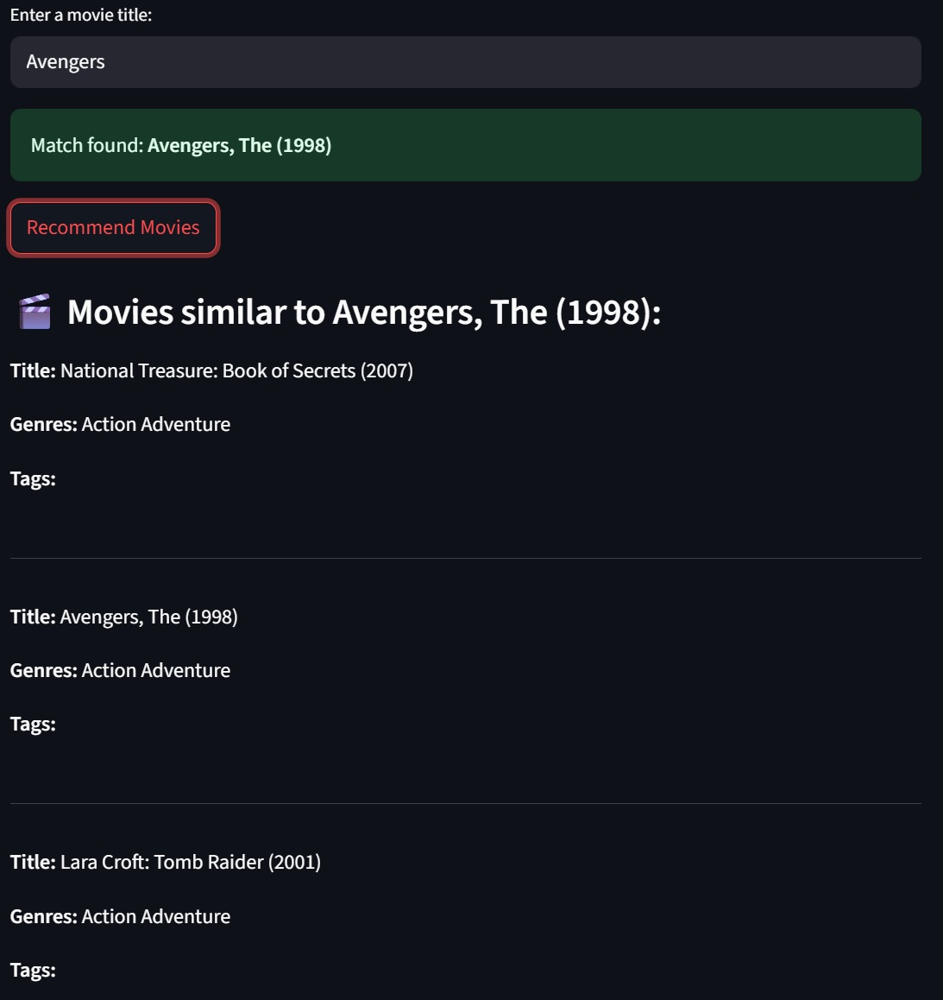
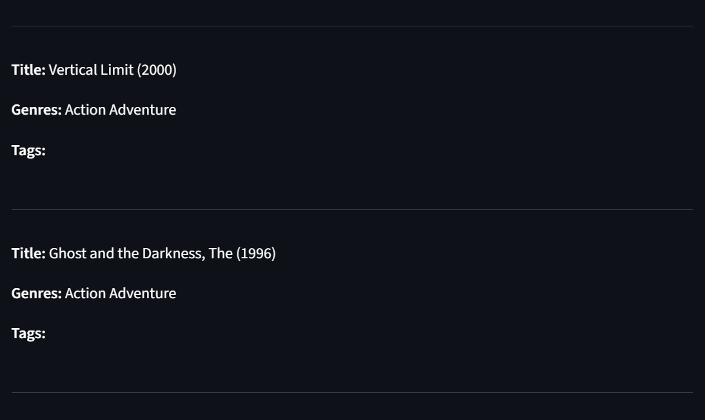

# 🎬 Movie Recommendation System

A simple **Content-Based Movie Recommender** built using the **MovieLens dataset**, **TF-IDF Vectorization**, and **k-Nearest Neighbors (kNN)**. It recommends similar movies based on **genres** and **user-provided tags**, with a clean UI built in **Streamlit**.

---

## 📌 Features

- 🔍 Search for a movie by title
- 🎯 Recommends 5 similar movies
- 🧠 Based on genres and user tags using TF-IDF + kNN
- 💡 Simple and fast UI with Streamlit
- ✅ No external API or internet required
- 📂 Works completely offline with local CSV files

---

## 🗂️ Dataset Used

Uses the **MovieLens 100k dataset** available at:
👉 [https://www.kaggle.com/datasets/aigamer/movie-lens-dataset](https://www.kaggle.com/datasets/aigamer/movie-lens-dataset)

Required files (place them in a `data/` folder):
- `movies.csv` — contains movie titles and genres
- `tags.csv` — contains user-submitted tags for movies

---

## 🛠️ Installation

```bash
git clone https://github.com/Quasicut7/movie-recommender.git
cd movie-recommender
pip install -r requirements.txt
```

---

## 🖼️ UI Screenshots

### 🔹 Homepage


### 🔹 Recommendations


