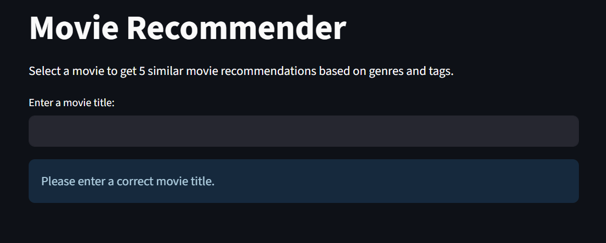

# 🎬 Movie Recommendation System

A **Content-Based Movie Recommender** built using the **MovieLens dataset**, **TF-IDF Vectorization**, and **k-Nearest Neighbors (kNN)**. It recommends similar movies based on **genres** and **user-provided tags**, with rich movie details fetched from **OMDb API**, all wrapped in a clean **Streamlit** UI.

---

## 📌 Features

- 🔍 Search for a movie by title
- 🎯 Recommends 5 similar movies with complete details
- 🧠 Based on genres and user tags using TF-IDF + kNN
- 🎬 Displays movie posters, ratings, plot, cast, and more via OMDb API
- 💡 Simple and fast UI with Streamlit
- 📊 Shows IMDb ratings, Metascore, director, actors, language, and country
- 📈 Comprehensive EDA with visualizations

---

## 🗂️ Dataset Used

Uses the **MovieLens 100k dataset** available at:
👉 [https://www.kaggle.com/datasets/aigamer/movie-lens-dataset](https://www.kaggle.com/datasets/aigamer/movie-lens-dataset)

Required files (place them in a `data/` folder):
- `movies.csv` — contains movie titles and genres
- `tags.csv` — contains user-submitted tags for movies

---

## 🛠️ Installation

```bash
git clone https://github.com/Quasicut7/movie-recommender.git
cd movie-recommender
pip install -r requirements.txt
```

---

## 🔑 Setup OMDb API Key

1. Get your free API key from [OMDb API](http://www.omdbapi.com/apikey.aspx)
2. Create a `.env` file in the project root
3. Add your API key:
   ```
   OMDB_API_KEY=your_api_key_here
   ```

---

## 🚀 Run the App

```bash
# Generate analysis plots (first time only)
python analysis/generate_plots.py

# Run the main application
streamlit run main.py
```

The app will open in your browser at `http://localhost:8501`

---

## 📁 Project Structure

```
movie-recommender/
├── data/
│   ├── movies.csv          # Movie titles and genres
│   └── tags.csv            # User-submitted tags
├── recommendation/
│   ├── __init__.py
│   ├── recommender.py      # MovieRecommender class
│   └── recommendation_ui.py # Recommendation UI module
├── analysis/
│   ├── __init__.py
│   ├── analysis_ui.py      # Analysis UI module
│   ├── generate_plots.py   # Plot generation script
│   ├── eda_analysis.ipynb  # Jupyter notebook for EDA
│   └── plots/              # Generated visualizations
├── screenshots/
│   ├── homepage.png
│   ├── recommendations_1.png
│   └── recommendations_2.png
├── main.py                 # Main application entry point
├── .env                    # OMDb API key (create this)
├── .gitignore
├── requirements.txt        # Dependencies
└── README.md
```

---

## 🖼️ UI Screenshots

### 🔹 Homepage


### 🔹 Recommendations


---

## 🛠️ Technologies Used

- **Python** - Core language
- **Streamlit** - Web UI framework
- **scikit-learn** - TF-IDF & kNN algorithms
- **pandas** - Data manipulation
- **OMDb API** - Movie metadata and posters
- **python-dotenv** - Environment variable management
- **matplotlib** - Data visualization
- **seaborn** - Statistical visualizations
- **wordcloud** - Tag cloud generation
